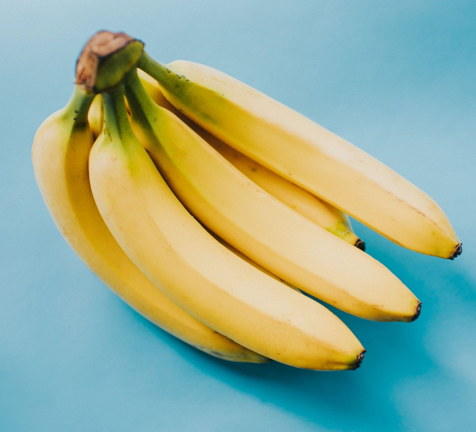

# This is Markdown
## Using Cramdown
### Apparently

Look how **Bold this looks** yes i said *Bold*, this is the link to the lab sheet [Lab Sheet](https://canvas.hw.ac.uk/courses/5395/pages/f28wp-web-programming-material?module_item_id=644006)

* * *
Woah i added a __Line__ pretty cool
What does this **Line** look like?

***
Not that different

There has been 13 Doctors, i will list them now because why not:
* William Hartnel
* Patrick Troughton
* Jon Pertwee
* Tom Baker
* Peter Davidson
* Colin Baker
* Sylvester McCoy
* Paul McGann
   * John Hurt
* Christopher Eccleston
* David Tennant
* Matt Smith
* Peter Capaldi
* Jodie Whittaker

Look at this image,  i like it.

>This is a blockquote
>>With Second Level BlockQuotes
>> Pretty Fancy
>>>And A Third Level??!
>>> Cool.
